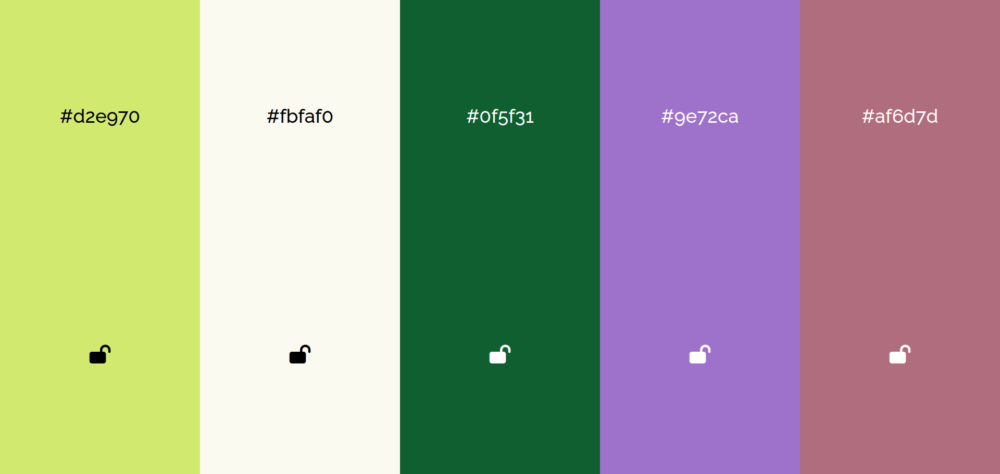

# Проект "Color generator"



Этот проект представляет собой веб-приложение для генерации случайных цветов и блокировки тех, которые вам нравятся. Проект создан с использованием HTML, CSS и JavaScript.

## Описание

"Coolors - Генератор Цветов" разработан в рамках учебного процесса и предоставляет пользователю интуитивно понятный интерфейс для создания и сохранения палитр цветов. Вы можете сгенерировать случайные цвета и, если вам понравился какой-либо цвет, заблокировать его, чтобы сохранить его в палитре. Также вы можете копировать цветовой код в буфер обмена для дальнейшего использования.
## Особенности проекта

- Генерация случайных цветов с возможностью блокировки тех, которые вам нравятся.
- Визуальное представление выбранных цветов в палитре.
- Возможность копирования цветовых кодов (например, HEX) в буфер обмена.
- Использование иконок Font Awesome для дополнительных возможностей.

## Технологии

Проект был разработан с использованием следующих технологий:

- **HTML**: Для разметки и структуры контента.
- **CSS**: Для стилизации и визуального оформления сайта.
- **JavaScript**: Для добавления интерактивных элементов.
- **Font Awesome**: Для вставки иконок в интерфейс.

## Запуск проекта

Для того чтобы посмотреть проект, вы можете открыть файл `index.html` в вашем веб-браузере.

```bash
open index.html
